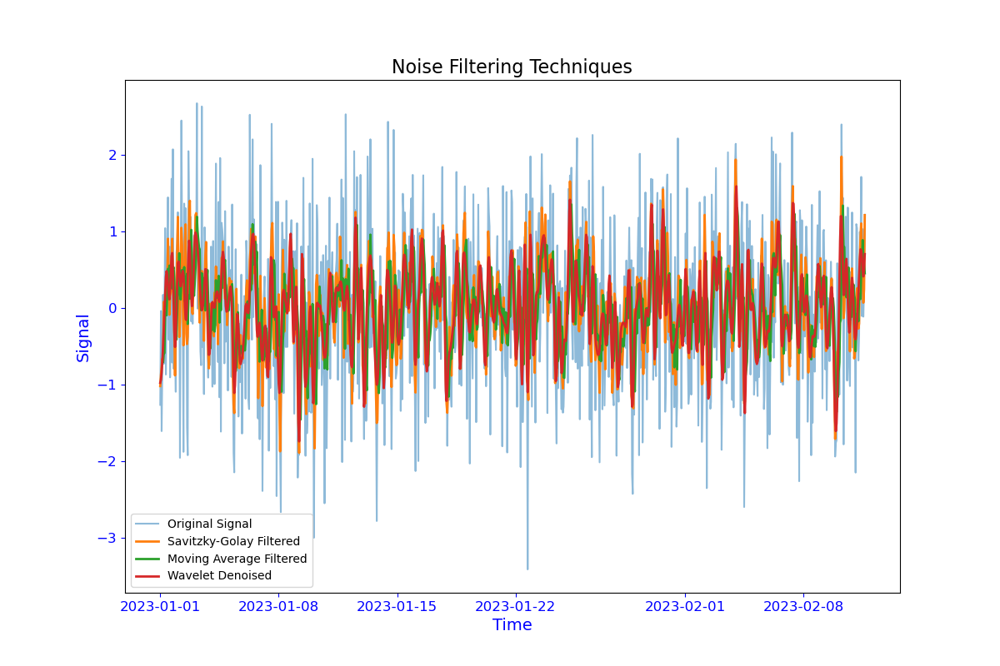

# Noise Filtering Techniques

This repository provides a Python implementation of various noise filtering techniques for time series data, including Savitzky-Golay filtering, moving average, and wavelet denoising. The code is designed to work with time vs power signal data, with the time input being a pandas datetime64 object.



## Techniques

1. **Savitzky-Golay Filtering**: This method smooths the signal using a local polynomial regression. It can also be used to compute the smoothed derivative of the signal.

2. **Moving Average**: This is a simple technique that smooths the signal by averaging over a sliding window of a specified length.

3. **Wavelet Denoising**: This method removes noise from the signal by thresholding the wavelet coefficients obtained through wavelet decomposition.

## Dependencies

- numpy
- pandas
- scipy
- pywt
- matplotlib

## Installation

1. Clone this repository to your local machine.

2. Install the required dependencies.


## Usage

Here is an example of how to use the NoiseFilter class:

```python
import numpy as np
import pandas as pd
from noise_filter import NoiseFilter

# Sample data
time = pd.date_range(start='2023-01-01', periods=1000, freq='1H')
signal = np.random.normal(0, 1, len(time))

# Create a NoiseFilter instance
filter_instance = NoiseFilter(time, signal)

# Apply Savitzky-Golay filter to obtain the first derivative
time_filtered, signal_filtered = filter_instance.savitzky_golay(window_length=7, polyorder=3, deriv=1)
```

## References

1. Savitzky-Golay Filtering:
   - Savitzky, A., & Golay, M. J. E. (1964). Smoothing and differentiation of data by simplified least squares procedures. Analytical Chemistry, 36(8), 1627-1639. DOI: 10.1021/ac60214a047

2. Moving Average:
   - Oppenheim, A. V., & Schafer, R. W. (2010). Discrete-Time Signal Processing (3rd Edition). Pearson.

3. Wavelet Denoising:
   - Donoho, D. L. (1995). De-noising by soft-thresholding. IEEE Transactions on Information Theory, 41(3), 613-627. DOI: 10.1109/18.382009
   - Mallat, S. G. (2009). A Wavelet Tour of Signal Processing: The Sparse Way (3rd Edition). Academic Press.


## Contact 

- Email: oren.sternberg@icloud.com
- GitHub: [@0r3ntal](https://github.com/0r3ntal)